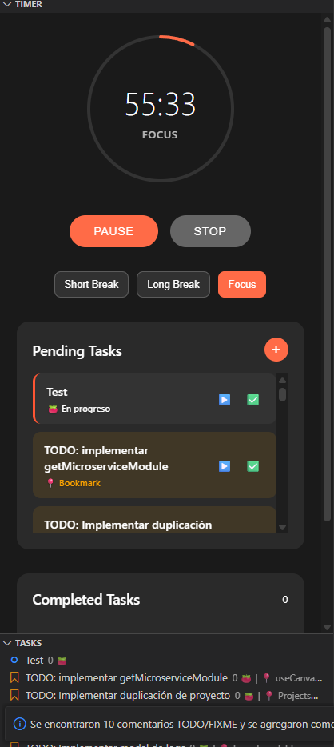

# Pomodoro Task Manager



Una extensión de VS Code que combina la gestión de tareas con la técnica Pomodoro para mejorar tu productividad.

## Características

- 📝 **Gestión de Tareas**: Crea, edita y elimina tareas directamente desde la barra lateral
- 🍅 **Temporizador Pomodoro**: Temporizador integrado con configuración personalizable
- ⏱️ **Seguimiento de Progreso**: Rastrea cuántos pomodoros has completado por tarea
- � **Escaneo de TODO/FIXME**: Encuentra automáticamente comentarios TODO y FIXME en tu código y los convierte en tareas
- 📍 **Bookmarks de Código**: Los comentarios escaneados se convierten en bookmarks que te llevan directamente al código
- �🔔 **Notificaciones**: Recibe alertas cuando termine un pomodoro o descanso
- 💾 **Persistencia**: Tus tareas y sesiones se guardan automáticamente
- ⚙️ **Configurable**: Personaliza los tiempos de trabajo y descanso

## Uso

### Gestión de Tareas

1. Abre la vista "Pomodoro Tasks" en el explorador de archivos
2. Haz clic en el ícono "+" para agregar una nueva tarea
3. Ingresa el nombre, descripción (opcional) y número estimado de pomodoros
4. Usa el menú contextual para editar, completar o eliminar tareas

### Escaneo de Comentarios TODO/FIXME


La extensión puede escanear automáticamente tu workspace en busca de comentarios TODO y FIXME:

1. Haz clic en el ícono de búsqueda (🔍) en el panel de Pomodoro Tasks
2. O usa el comando `Pomodoro: Escanear comentarios TODO/FIXME`
3. La extensión escaneará todos los archivos de código en tu workspace
4. Los comentarios encontrados se convertirán automáticamente en tareas tipo bookmark
5. Haz clic en una tarea bookmark para navegar directamente al código

**Formatos soportados:**
- `// TODO: descripción del trabajo a hacer`
- `/* FIXME: algo que necesita ser corregido */`
- `# TODO: comentarios en Python, Shell, etc.`
- `<!-- TODO: comentarios HTML -->`
- Y muchos otros formatos de comentarios

**Archivos escaneados:**
- JavaScript/TypeScript (`.js`, `.ts`, `.jsx`, `.tsx`)
- Python (`.py`)
- Java (`.java`)
- C/C++ (`.c`, `.cpp`, `.h`)
- HTML/CSS (`.html`, `.css`, `.scss`)
- Y muchos otros tipos de archivo de código

### Temporizador Pomodoro

1. Haz clic derecho en una tarea y selecciona "Iniciar Pomodoro"
2. O usa el comando `Pomodoro: Iniciar Pomodoro` desde la paleta de comandos
3. El temporizador aparecerá en la barra de estado
4. Recibe notificaciones cuando termine cada sesión

### Comandos Disponibles

- `Pomodoro: Agregar Tarea` - Crear una nueva tarea
- `Pomodoro: Iniciar Pomodoro` - Iniciar un pomodoro
- `Pomodoro: Pausar Pomodoro` - Pausar/reanudar el temporizador
- `Pomodoro: Detener Pomodoro` - Detener el temporizador actual
- `Pomodoro: Escanear comentarios TODO/FIXME` - Buscar automáticamente comentarios en el código
- `Pomodoro: Abrir ubicación del bookmark` - Navegar al código de una tarea bookmark

## Configuración

Puedes personalizar la extensión en la configuración de VS Code:

```json
{
  "pomodoroTasks.workDuration": 25,        // Duración del trabajo (minutos)
  "pomodoroTasks.shortBreakDuration": 5,   // Duración del descanso corto (minutos)
  "pomodoroTasks.longBreakDuration": 15,   // Duración del descanso largo (minutos)
  "pomodoroTasks.longBreakInterval": 4,    // Pomodoros antes de descanso largo
  "pomodoroTasks.autoStartBreaks": false,  // Iniciar descansos automáticamente
  "pomodoroTasks.notifications": true      // Mostrar notificaciones
}
```

## Técnica Pomodoro

La técnica Pomodoro es un método de gestión del tiempo desarrollado por Francesco Cirillo:

1. **Trabajo**: 25 minutos de trabajo concentrado
2. **Descanso corto**: 5 minutos de descanso
3. **Repetir**: Después de 4 pomodoros, toma un descanso largo de 15 minutos

## Instalación para Desarrollo

1. Clona este repositorio
2. Ejecuta `npm install` para instalar dependencias
3. Presiona `F5` para abrir una nueva ventana de VS Code con la extensión cargada

## Empaquetado

Para crear un archivo VSIX:

```bash
npm install -g vsce
vsce package
```

## Contribución

¡Las contribuciones son bienvenidas! Por favor:

1. Haz fork del proyecto
2. Crea una rama para tu característica
3. Haz commit de tus cambios
4. Envía un pull request

## Licencia

MIT License - consulta el archivo LICENSE para más detalles.